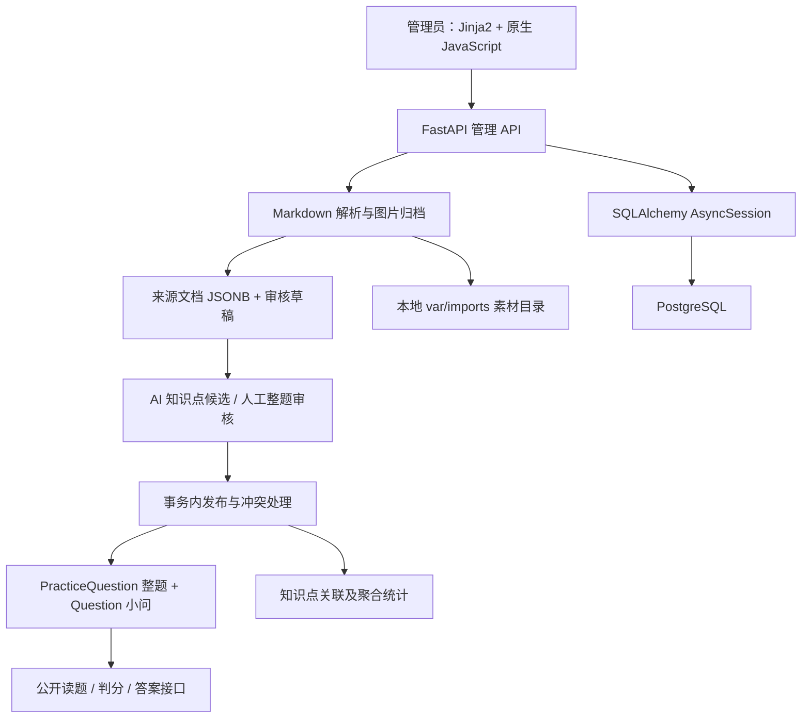

# 软设岛代码审查与 FBA 选型评估

评估日期：2026-09-27。范围：当前工作目录源码与公开上游资料。性质：只读审查，本文是唯一新增交付文件；不代表已实施改造。

## 1. 结论先行

**推荐方案三：保留现有管理端和稳定题库业务，在同一后端内参考 FBA 建立统一基础设施，让 H5 新业务按统一分层开发。暂不整体迁入 FBA，也不建立两套长期独立的后端。**

理由：

1. 项目已经采用 FastAPI、Pydantic、异步 SQLAlchemy、PostgreSQL 和 Alembic，与 FBA 并不存在需要整体换栈才能解决的根本冲突。
2. 最值得保留的是题块/草稿/正式题的边界、组合题、小问判分、知识树、素材归档、人工审核和补充发布规则。这些是已有业务资产，FBA 不提供替代实现。
3. 当前确实存在上线前必须解决的问题，尤其是管理端无认证、上传提交后的错误清理风险、长事务内调用 AI、缺少考生数据模型及生产运维保障。但这些问题可以分别修复，不构成必须重写全部后端的证据。
4. 管理端是 Jinja2 + 原生 JavaScript，与当前 URL、裸 JSON 响应及模板上下文直接耦合。整体迁入 FBA 的响应包装、身份模型和工程启动方式，会产生适配成本，不是换目录即可完成。
5. FBA 的收益主要来自通用工程能力；当前阶段引入整个部门、菜单、插件、任务、监控体系，可能超过实际需要。先解决明确缺口，再决定是否采用具体组件。

这里的“没有必须整体迁移的证据”，**不等于可以直接公网部署，也不等于已经证明运行稳定或性能达标**。

## 2. 证据范围与验证边界

### 2.1 已检查

- 后端入口、配置、API、业务服务、数据访问、模型、知识树同步，以及 Markdown 解析/审核/发布/图片/AI 调用链。
- 管理端模板与 JavaScript：`base.html`、`imports.html`、`markdown.html`、`markdown_script.html`；历史模板及其路由边界。
- 全部 9 个迁移文件的迁移链与 DDL/数据变更，重点核查 0008 和 0009。
- `pyproject.toml`、`docker-compose.yml`、`alembic.ini`、`tests/conftest.py`、测试函数清单及关键测试实现、README、CONTEXT、业务 ADR。
- `.env` 仅枚举键名，未输出密钥和配置值。文件中可见 AI 配置键；实际进程环境是否覆盖数据库、AI 等设置未验证。
- 静态 AST 解析了 `app/`、`tests/`、`alembic/` 下 51 个 Python 文件，语法解析成功；识别到 79 个 `test_*` 函数定义。此数不等于 pytest 参数展开后的用例数，更不等于通过数。

### 2.2 未执行及原因

- 未连接现有数据库，未启动项目、Docker 或 FBA，未执行迁移、同步知识树、导入、发布、联网 AI 调用或 pytest。
- `tests/conftest.py:35` 的 fixture 会执行 `DROP SCHEMA public CASCADE`，随后运行 Alembic；不能在本次只读审查中直接运行。
- 未进行浏览器交互、真实漏洞利用、压测、依赖漏洞库扫描及备份恢复。历史 `var/` 截图/报告不作为本次测试通过证据。
- 当前目录执行 `git status` 返回“not a git repository”；无法固定本地 Git 提交、审阅提交历史或用 Git diff 证明工作区基线。不能据此推断项目从未使用版本管理。
- 数据库实际 revision、数据量、索引使用情况、已部署网络边界、在线用户量、故障率、模型准确率、性能指标均未知。

文中“源码事实”指静态代码可以确认；“风险”指有明确触发条件但未在隔离环境动态复现；估算均为规划判断。

### 2.3 FBA 资料版本

用户提供的文档站点本次请求返回 HTTP 403，改读该组织的**官方文档源码仓库**，不是第三方摘要。

- 后端源码固定提交：[`123a44aed02daf5ea60d2a7469625c933d3bb759`](https://github.com/fastapi-practices/fastapi-best-architecture/tree/123a44aed02daf5ea60d2a7469625c933d3bb759)。
- 官方文档固定提交：[`ad443174ef8ecea9c2ad0879198e481db4f8a346`](https://github.com/fastapi-practices/fastapi_best_architecture_docs/tree/ad443174ef8ecea9c2ad0879198e481db4f8a346)。
- 结论只针对这些提交，不将 master 当作稳定发行承诺。未来正式选型需固定 release/commit 和依赖锁文件，再验证安装与兼容性。

## 3. 当前架构



### 3.1 实际技术与模块边界

| 层/能力 | 当前实现与证据 | 判断 |
|---|---|---|
| 入口 | `app/main.py:9` 注册知识树、导入、页面、Markdown 和公开刷题路由；`app/server.py:14` 启动 Uvicorn | 单体应用，适合当前业务规模；没有必须微服务化的证据 |
| 前端 | `app/imports/admin.py:25` Jinja2；`templates/base.html:63` fetch；`markdown.html:36` 响应式布局 | 可保留页面和操作路径；未发现独立 H5 前端工程 |
| API/服务/数据访问 | `app/api.py:29` → `repository.py:53`；导入 API → service/workflow；Markdown 路由直接执行 SQL 和业务规则 | 有分层基础，但导入部分边界不一致 |
| 数据连接 | `app/db.py:9` async engine、pool_pre_ping；`get_session` 只提供会话 | 异步访问已存在；事务提交由调用方负责 |
| 题库领域 | `models.py:133` 共享材料、`:156` 小问、`:534` 整题、`:547` 整题成员、`:554` 历史快照 | 领域模型比通用 CRUD 更重要，应保留 |
| 知识树 | YAML → catalog 校验 → sync；节点带分类指导、别名等 | 不应替换为 FBA 菜单/字典模块 |
| 发布 | `markdown_workflow.py:245` 锁定、重验、冲突、写正式表、聚合 | 已有较好的事务意识 |
| 存储 | `storage.py:57` 路径边界；`markdown_storage.py:107` 图片校验与哈希命名 | 单机可用，多实例需要共享存储策略 |
| 历史流程 | `main.py:20` 部分旧 mutation 返回 410；`api.py:458` 将 Markdown 发布转到新 workflow | 应保留历史读兼容，再按路由清单收口旧写接口 |

### 3.2 应明确保留的实现

- **人工审核门禁**：`markdown_api.py:318` 检查题块歧义、结构、逐小问校验和知识点；AI 辅助 `:409` 验证 schema、原文对应及答案序列，`:434` 保存建议，不直接发布。
- **发布串行化和幂等返回**：`markdown_workflow.py:246` 锁批次，`:247` 重复发布返回已有结果；`:255` 以科目/年份/期次/批次键取事务 advisory lock，再锁正式试卷。
- **冲突保护**：`:283` 验证整题成员边界，`:298` 验证旧内容指纹，`:308` 保存替换前快照；不是简单覆盖。
- **数据库约束**：`models.py:73` 父子节点同科目外键、`:161` 小问与试卷同科目、`:217` 正确选项归属、`:252` 已确认主知识点部分唯一索引、`:566` 素材唯一所有者约束。
- **图片与 HTML 防护**：`markdown_storage.py:34` ZIP 展开大小/数量限制、`:40` 路径及符号链接拒绝；`markdown_render.py:27` 图片 URL 白名单和最终 bleach 清洗。不能因为模板使用 innerHTML 就直接断言存在 XSS。
- **分类追溯**：`models.py:607` 保存 provider/model/prompt/checksum/fingerprint/raw_response；`service.py:1506` 内容指纹及历史兼容门禁。
- **审核列表批量查询**：`markdown_api.py:48` 批量装载关系，`tests/test_markdown_integration.py:255` 有查询次数断言。应保留这些优化，而不是把所有读取都改回通用单条 CRUD。

## 4. 具体发现：按优先级处理

P0 表示公网开放前阻断项；P1 表示首轮加固；P2 表示随 H5/多人协作扩展处理。优先级不是已发生事故的宣称。

### F01 · P0：管理 API 和原始素材没有身份认证

**源码事实**：`app/imports/api.py:103` 上传、`:203` 删除、`:453` 发布；`markdown_api.py:31` 的 router 与 `admin.py:23` 均未配置认证依赖。依赖只有数据库/存储/AI。`main.py` 未注册认证中间件。README 第 17 行明确写明仅供本机或可信内网使用。

**影响**：能访问服务的人可直接调用管理接口，查看含答案的草稿、触发付费模型、审核和发布。`api.py:488` 的管理素材读取不要求“已发布”，因此仅给公开题目接口加鉴权不能保护管理数据。部署端是否另有网关认证未知。

**建议**：上线前统一保护 `/admin/*` 和 `/api/v1/admin/*`，定义导入者/审核者/发布者等最小权限；记录操作者。HTML 页面和 `` 请求无法自然附带 JS 的 Bearer 请求头，要明确选用同源安全 Cookie 会话或 BFF，再落实 CSRF、Secure、HttpOnly、SameSite；不能只给 fetch 加 token。考生账号权限与管理员权限分离，不能把 FBA 菜单后台权限当成考生资源所有权。

**隔离验收**：匿名不可读写管理资源；登录但无发布权限返回拒绝；素材、旧 API、页面也受保护；登出/封禁后失效。公开读题与答案是否允许游客由产品规则决定，当前公开 solution 本身不自动等同漏洞。

### F02 · P1：上传成功提交后，响应读取异常可能误删素材

**源码事实与触发条件**：`app/imports/api.py:137` 已 `commit()`，`:138` 调用 `get_batch_read()`；同一 try 的 `:140–142` 在任意异常后 rollback 并 `storage.remove_batch()`。`service.py:2801` 读取响应时会再次访问数据库，因此存在提交后查询失败的真实代码路径。

**风险**：已提交的数据库记录不会因后续 rollback 撤销，但原文及图片会被删除，形成悬空存储引用。本次未注入故障，不声称已经发生。

**根因**：清理边界没有区分“提交前失败”和“提交后响应失败”。同文件 `api.py:203` 删除接口已经将数据库提交和后续文件清理分开，可作为一致性处理的内部参考。

**建议及验收**：隔离环境让 `get_batch_read` 在提交后抛错，先建立回归证据；随后让补偿只清理未提交上传，采用暂存/确认及孤儿文件对账。不能仅扩大 try/except 或盲目重试整个上传。

### F03 · P1：AI 调用位于请求和数据库锁持有期间

**证据**：上传 `api.py:135` → `markdown_workflow.initialize:61–63` 下载图片、创建草稿、自动分类，最后才在 API commit；编辑 `markdown_api.py:242` 锁批次，`:288` 自动分类，`:289` 提交；分类 `service.py:1563` 锁行，`:1704` 等待模型。`auto_classify:383` 按每 5 个顺序处理。文本辅助 `markdown_api.py:391` 锁定后也直接 await 模型。

**影响**：HTTP 超时与连接池/锁占用叠加，服务重启或进程退出不能依靠持久任务恢复；批次行锁会让同一批次不同题目的编辑互相等待。async 网络等待不会一直占 CPU，但会保留请求与事务资源；同步 ZIP/图片/磁盘工作还可能阻塞事件循环。

**现有保护**：`markdown_api.py:348` 有非阻塞事务 advisory lock，分类失败保存 run 状态，`:370` 提交。不能说完全没有并发或失败处理。

**建议**：短事务创建持久 job/outbox → worker 外部调用 → 短事务校验内容指纹和知识树版本后写回。重试只能作用于暂时性错误，采用退避/抖动/上限；过期结果拒绝覆盖、人工修改优先、失败可重放。任务至少一次投递不等于业务恰好一次，必须设计幂等键。任务化只需让管理端增加进度与重试反馈，无须改变原有审核步骤。

### F04 · P1：H5 读取路径存在 N+1 和发布全表装载

**证据**：`markdown_api.py:689–691` 获取一页整题后逐题调用 `read_question`；`markdown_workflow.py:233–238` 逐小问查询选项和正确答案。答案不返回客户端，但普通读题仍查询正确答案。`:262` 发布时 `select(QuestionAsset)` 将全库素材映射进内存。`admin.py:39` 批次列表逐批调用多查询的 `get_batch_read`。

**影响**：查询数量随整题/小问数增长；素材数量增长会放大发布内存和延迟。当前分页限制 100 是保护，但不能消除查询放大。没有实测 QPS、耗时或内存数值。

**建议**：单独的 practice 查询服务，按一页题目 ID 批量查成员/选项；答案路径单独加载；仅获取发布涉及的素材哈希。先用查询计数测试与代表性数据测量，再决定缓存。Redis 不能替代合理 SQL。

### F05 · P1：工程分层不一致，直接粘贴 FBA 事务依赖会有风险

**证据**：`imports/service.py` 3023 行，混合旧 OCR、解析、分类、审核、发布、查询投影；`markdown_api.py` 764 行，含 SQL、审核、复制素材及判分。`markdown_api.py:16` 从另一 API 模块导入基础依赖和异常转换，`:21` 使用 service 私有函数；`admin.py:102` 反向依赖 API 的 context/block_for。`admin.py:64` 在前面的 return 之后保留不可达旧逻辑。

**影响**：API 与业务服务互相依赖，变更难以隔离；不同函数自行 commit，例如 `knowledge/sync.py:87`、历史 `service.py:413/:612`，不能机械套上外层事务。长文件本身不是必须重写的理由。

**建议**：先抽共用依赖/异常、拆读写服务、明确每个用例的事务拥有者，再渐进拆分 import/review/publication/practice 模块。旧路由保持兼容适配器。不要为形式统一把所有 SQL 强行搬成碎片化 CRUD，发布仍应由一个业务用例控制原子性。

### F06 · P1：上线部署与供应链可重复性不足

**证据**：`docker-compose.yml:2` 仅有 PostgreSQL，`:7` 示例弱口令，`:9` 映射 5432；未见应用 Dockerfile、代理/TLS、worker、生产备份作业或 CI 配置。`pyproject.toml:13` 起采用依赖范围，当前目录未见依赖锁文件。`app/api.py:19` health 只返回 ok。`app/db.py` 未注册进程退出时的 engine dispose。

**影响**：compose 更接近开发基础设施，不能当成已完成生产部署；没有锁文件无法从配置确定实际安装依赖和漏洞状态。数据库端口实际是否可从外网访问取决于主机网络，未验证。

**建议**：固定可复现依赖与镜像、独立最小权限 DB 账号、私网数据库、应用 readiness/liveness、优雅关闭、数据库与素材成套备份及恢复演练。先建最小可运维方案，不要求一次部署 FBA 完整 Grafana/消息队列套件。

### F07 · P1/P2：数据版本与知识树版本的语义需要补齐

**事实 A**：`knowledge/sync.py:41` 拒绝同版本不同 checksum；但 `:71–75` 新版本会原位更新同一 `KnowledgeNode`。`service.py:1566` 获取批次 release，`:1569` 却读取当前节点组成分类目录。release 表保存 checksum，不保存每版完整节点快照。

**风险 A**：知识树更新后，旧批次关联旧 release，却可能用最新节点分类；当前只有单一版本时未必触发。应明确“批次固定版本”还是“始终迁到最新版”，否则审计复现不可靠。发布 `markdown_workflow.py:326–349` 检查主知识点数量并写表，但没有重新校验节点 active/topic；审核后节点状态变化的场景需测试。

**事实 B**：替换正式题 `markdown_workflow.py:329–349` 保留 Question ID、更新内容并重建选项；`:308` 有旧快照，但 H5 `/check` 没有题目版本参数或持久答题记录。

**风险 B**：考生读题后管理员替换答案，提交会按新内容判分；未来错题本也不能仅引用可变 question_id。应在新学习记录中固定题目 revision/content_hash 与作答快照，冲突时提示重载，而不是让迁移框架决定业务语义。

### F08 · P2：数据库约束仍有可补强处

- `models.py:547` 的 PracticeQuestionPart 有成员唯一约束，但没有 `(practice_question_id, position)` 唯一、`position > 0` 检查，也未在数据库层保证成员与整题同试卷。当前发布用例按正确方式写入；不能把缺约束当作已有脏数据证据。
- `models.py:517` 的 `(document_id, page_no, sha256)` 唯一约束，在 Markdown 的 `page_no=NULL` 下不能保证同文档同哈希唯一；业务查询和批次锁提供部分保护。增加约束前先扫描真实重复数据。
- `models.py:585` 的 asset_id 外键未见专门索引，而公开图片 `markdown_api.py:751` 按该列查 usage。需在副本上 EXPLAIN 后决定索引，而非未经测量批量加索引。
- 节点自环被约束禁止，但多节点环不是数据库约束直接排除的；常规 YAML 导入层级提供保护。递归读取 `repository.py:71`、`:85` 对坏数据需有诊断策略。

### F09 · P2：图片下载已有 SSRF 防护，但 DNS 检查与连接未绑定

**证据**：`markdown_storage.py:84` 自行 DNS 查询，`:89` 验证地址，`:92` 再由 httpx 按 URL 连接；每次重定向也重验，且 `trust_env=False`。存在针对已知 CDN 的保留地址例外 `:85–90`。

**风险**：检查与连接可能发生二次解析，理论上存在 DNS rebinding/时间差；本次未复现。不能描述为完全未做 SSRF 防护。优先网关/worker 出网限制、允许的图片源范围和受控解析连接；CDN 例外应配置化并限制到实际环境。

### F10 · P2：日志、错误契约与管理前端测试需要工程化

**证据**：存在 `logging.getLogger` 和数据库中的分类/修复记录，不能说“没有日志”；但 `main.py` 未见统一请求 ID、操作人审计中间件。`markdown_api.py:375/:445` 将 `str(exc)` 返回调用者；`api.py:222` 错误警告含路径。新 Markdown 端点多数返回 dict，没有明确 response_model。`templates/base.html:69` 直接依赖 HTTP 状态与 `detail`；`markdown_script.html:39` 单行承载大量编辑与审核行为。

**建议**：建立错误码、脱敏异常、request_id/job_id/batch_id 链路，区分技术日志与不可随意变更的审核审计；原始 AI 响应定义保留期与访问权限。先补 API schema 和管理交互契约测试，再拆 JS 模块，保留 DOM 与视觉设计。

### F11 · P2：公开列表筛选与显示顺序存在边界风险

`markdown_api.py:689` 列表只按 paper verified 筛选，随后 `public_unit:700` 对任一未发布小问抛 404；如果未来支持小问下架或历史不完整记录，一条异常整题可能使整页失败。列表排序为 created_at + UUID，不是原题号顺序；补充导入后是否符合“按试卷练习”需明确。隔离构造状态混合数据验证，再在数据库查询层筛选完整可见整题并确定稳定排序契约。

## 5. Alembic 与数据库规范专项

### 5.1 已有良好基础

`alembic/env.py:17` 绑定 `Base.metadata`，`:27/:34` 开启 compare_type，`:39` 使用异步引擎、NullPool，DDL 在事务上下文运行。迁移文件静态链为：

`0001 → 0002 → 0003 → 0004 → 0005 → 0006 → 0007 → 0008 → 0009`

覆盖初始题库、导入工作流、DOCX 内容、修复记录、素材引用、分区建议、分类指纹、Markdown 整题、公共解析。未发现静态多 head；这不是线上 `alembic_version` 已到 head 的证明。

### 5.2 必须纳入验证的细节

1. **0008 是数据迁移，不是纯加表**：`20260925_0008_markdown_practice.py:22` 将有试卷的 official 来源改 recalled；`:45` 读取历史题并回填整题，`:52` 使用全零 content_hash。该来源判断与现有 ADR 一致，但未来引入真正官方题时不可照搬。数据量大时需评估事务时间与内存；没有线上耗时结论。
2. **不能承诺任意 downgrade**：0009 第 13 行明确拒绝丢弃公共解析；0008 第 61 行在存在整题时拒绝降级。即使整题为空，其后收紧 NULL/唯一/来源约束仍可能被草稿或 recalled 数据阻挡。回退应以兼容旧应用的新增式 schema 与备份恢复为主。
3. **离线 SQL 模式有限制**：env 支持 offline，但 0008 的 SELECT 结果参与 Python 循环，不能仅凭 env 模板断言 `upgrade --sql` 全链可用。
4. **Windows 事件循环待验证**：`server.py:10` 为 psycopg async 显式选 SelectorEventLoop；`alembic/env.py:52` 和 `knowledge/sync.py:110` 使用普通 asyncio.run。Windows 默认策略是否已由外部修改未知，应在干净环境检查这两个 CLI，不能把 API 启动成功当作 CLI 可用证据。
5. **URL 配置边界**：`alembic/env.py:12` 将连接串传入 ConfigParser 的 set_main_option；带百分号编码的凭据需验证插值转义。当前实际数据库凭据未读取。
6. **版本管理归属**：若新增 FBA 系统表，应明确表名前缀、metadata 和 Alembic version 表归属；禁止直接向现有库运行 FBA 全量初始化 SQL，禁止两个迁移器无边界管理同一张业务表。

## 6. 测试覆盖评估与隔离方案

### 6.1 源码显示已有的覆盖

| 范围 | 测试证据 | 边界 |
|---|---|---|
| 知识树/约束/聚合 | `test_catalog.py:6`、`test_integration.py:41/:82/:150` | 有幂等与约束测试；未在本次运行 |
| Markdown 规则 | `test_markdown_parser.py` 13 个测试函数 | 涵盖共题干、断号、图片位置、公共解析、公式表格 |
| 发布与冲突 | `test_markdown_integration.py:53` | 整题发布、判分、重复发布、内容冲突与替换快照 |
| 图片/安全 | 同文件 `:119/:153/:165` | 补图、补充批次、ZIP 越界、HTML 清洗 |
| 审核/AI | 同文件 `:274/:311/:345/:364/:409/:428` | 整题重验、回滚、保留 ID、分类失败、AI 不自动批准 |
| 并发/读取 | 同文件 `:449`、`:255` | 手动持有 advisory lock 后验证 409；批次详情查询计数，不等于完整多 worker 压测 |
| 历史链路 | `test_import_integration.py`、`test_segmentation.py`、`test_repair_evidence.py` | 仍覆盖已退休流程，未来应区分历史兼容与主路径回归 |

当前并非“没有测试”，但没有覆盖率配置与本次执行数据，不能给出百分比。AST 语法检查不能验证第三方依赖导入和业务行为。

### 6.2 缺口

优先补匿名/越权/注销、上传提交后故障、任务重复投递与进程崩溃、陈旧 AI 结果、多人编辑覆盖、发布和分类并发、知识树升级、读题后答案替换、真实数据副本迁移、公开分页混合状态及查询计数、移动端管理交互回归。

`tests/conftest.py:24` 只检查库名 `_test` 后缀，无法证明其是可销毁专用库。fixture 最后 rollback 也无法撤回路由或 `sync_catalog` 内已提交的数据，测试之间可能依赖持久残留。应采用每测试独立清理或正确绑定外层事务/savepoint的方案，并特别测试显式 commit 行为。

### 6.3 后续允许写入测试前的隔离方案（本次未执行）

1. 独立 PostgreSQL 容器/实例、全新随机测试库和 volume；端口仅绑定本机，账号无法连接业务库。不可复用现有 `software_designer_test`。
2. 独立临时素材目录，测试进程显式覆盖 DATABASE_URL、TEST_DATABASE_URL 和 IMPORT_STORAGE_ROOT，禁止挂载 `var/imports` 与业务备份目录为可写。
3. AI 使用确定性 fake client，并阻断测试进程外网，避免 `.env` 中真实模型密钥被继承使用。
4. 首先空库升级到 0009，做 metadata drift 检查；另用经确认的脱敏副本测试 0007→0009。随后运行契约、故障注入、并发及管理端浏览器用例。
5. 记录查询数、延迟分布、锁等待和数据库连接池占用，先形成基线再约定目标；不预先编造可支持用户数或性能提升倍数。
6. 所有清理只针对预先登记的随机资源；保留测试结果与失败证据。开始这些写测试前由用户确认隔离范围。

## 7. FBA 能力对照：原生、插件与自研业务

证据标识对应文末固定提交链接；“原生”指上游主仓实现，不代表已部署、自动启用或可以零依赖拷贝。

| 能力及归属 | FBA 实际提供 | 软设岛现状/实际缺口 | 引入收益 | 难度与风险 |
|---|---|---|---|---|
| 分层，原生 [U1] | API/schema/service/crud/model 约定 | 知识树分层清楚，导入 API 过重 | 统一新增代码边界 | 低至中；不能仅改目录，也不必全改存量 |
| JWT，原生 [U2] | token 校验、Redis token 会话及用户缓存、认证依赖 | 无认证、无管理员账号域 | 明显，公网前必要 | 中；依赖上下文、系统用户、Redis，HTML/图片认证需适配 |
| RBAC，原生 [U3] | 默认角色菜单与权限标识依赖 | 无角色和操作权限 | 支持多人审核/发布分权 | 中；未挂依赖不会自动获得业务授权；FBA 菜单不等于知识树 |
| Casbin，外置插件 [U3] | 文档明确从 v1.2.0 起外置 | 当前无复杂 ABAC/策略需求 | 暂无明确必要收益 | 中至高；插件版本、授权与维护需另核实 |
| 用户/角色/部门/菜单，主仓 | admin 系统模型、服务与 API | 管理员与考生身份均待建 | 可复用后台账号能力 | 中至高；考生不应被迫拥有后台部门/菜单 |
| Redis，原生 [U4] | 异步池、超时、命名空间工具；认证直接使用 | 未见 Redis 依赖/服务 | 会话失效、限流、部分缓存 | 中；新增故障域；不能用可丢缓存保存唯一答题事实 |
| Celery，原生可裁剪 [U5] | worker、beat、结果后端、异步 task 适配 | 没有持久队列；请求内处理 AI | 降低长请求、增强任务运维 | 中至高；幂等/outbox/业务重试必须开发 |
| 自动重试，部分原生 [U5] | TaskBase 的 autoretry_for 仅 SQLAlchemyError，配置最大次数；broker 重连 | JSON 结构纠正最多再试一次，失败记录与人工重试；无任务恢复 | 提供机制，不提供业务正确性 | 中；AI 429/超时与不可重试校验错误要分类；不能宣传自动处理所有失败 |
| 日志/观测，原生集成 [U6] | 操作日志中间件、request_id、Loguru、OTel/Grafana 配置 | 有零散日志与分类记录，无统一操作者审计 | 运维排障与责任追溯 | 中；脱敏、队列可靠性、存储成本仍需设计，业务快照不能由访问日志代替 |
| ORM/Alembic，原生 [U7] | SQLAlchemy、事务依赖、PG/MySQL、模型基类 | 相同大技术栈，业务采用 UUID、JSONB、ARRAY、PG 锁 | 规范参考多于换栈收益 | 中至高；默认 PG 驱动 asyncpg，现项目 psycopg；基类/ID/时间字段不同 |
| 分页/响应/异常，原生 [U8] | 统一 code/msg/data、schema/pagination 组件 | 裸 JSON、HTTP detail，Markdown 输出模型不全 | 改善新增 API 契约 | 中；直接全量包装将破坏已有 JS，应用版本或适配器解决 |
| 字典/参数/公告/邮件/OAuth2/代码生成，随仓插件 | 位于 backend/plugin，各自 plugin.toml；OAuth2 示例为 GitHub/Google [U9] | 大部分不是当前核心需求 | 按需求选装 | 中；“随仓”不等于业务必需，不等于微信登录已实现 |
| APScheduler，非当前内置主方案 [U10] | 文档称已转 Celery，独立仓库发行，插件计划 | 暂无调度需求证据 | 不需要为名称齐全引入 | 低至中；不要把规划能力当成当前实现 |
| 多租户，实验/插件 [U11] | 主仓不提供完整租户后台/套餐业务 | 当前单产品，未提出租户需求 | 暂不纳入 | 高；会影响所有约束与查询，不能配置即完成 |
| 前端，另一个工程 [U12] | 文档介绍 Vben Admin Antd 附加实现 | Jinja2 审核台基本满意 | 不是本次换后台的理由 | 高；FBA 前端不是 H5 刷题产品，也不承接现有审核 UI |
| 题库/Markdown/审核/刷题/AI 教学，自研 | 所审主仓未提供软设岛这些业务 | 已有题库审核；学习记录、错题本、推荐等未建 | FBA 只提供通用基础设施 | 高；三方案都要开发，不能将其算成迁移自动获得 |

补充：上游文档有 AI 辅助开发相关章节，不能据此推断已提供业务 RAG、智能出题、学习诊断或模型评估。插件市场许可证/收费/源码政策取决于各插件；主仓 MIT 不自动覆盖所有第三方插件。

## 8. 三个方案的实质比较

方案一定义为“在现有组织方式中抽取少数 FBA 能力”；方案三定义为“制定统一的目标分层，新业务遵循，旧业务按风险逐步收敛”。两者都能保留 UI，区别不在是否增加 Redis。

| 维度 | 一：选择性引入 FBA | 二：全新 FBA 后端迁移 | 三：保留业务、统一基础设施（推荐） |
|---|---|---|---|
| 保留范围 | 题库模型、现有 API、模板和大部分服务 | 解析器、校验规则、领域语义和部分模型可搬；服务不能假定原样兼容 | 全部稳定领域和前端；新模块按清晰边界组织 |
| 重写范围 | 认证/日志/队列适配代码，局部修复 | 入口、依赖、事务、认证、API 适配、部署、较多测试 fixture | 基础设施与高风险用例边界，逐步拆重服务；H5 新业务新增 |
| DB 兼容 | 保留 PostgreSQL、UUID、历史链，新增表 | 可继续用 PG，必须设计 metadata/迁移归属；不可自动沿用默认 FBA 主键及初始化 SQL | 业务表与 UUID 保留，一个迁移责任边界，新增式演进 |
| API 兼容 | 最容易保持 | 全量 code/msg/data 与旧裸 JSON 冲突，需要兼容路由 | 旧 v1 保持，H5 新契约显式版本；不无故重包旧响应 |
| 管理端影响 | 登录、权限和进度反馈等小改 | 模板挂载、静态素材认证、错误契约和全部交互需回归 | 同一页面和审核步骤，只增加必要能力 |
| 开发/测试负担 | 初期较低，后期可能持续零散适配 | 最高，需要旧新等价、迁移与回退演练 | 中等，可按模块验收、逐步发布 |
| 技术风险 | 拷贝 FBA 片段隐藏依赖，形成不完整安全实现 | 业务重写回归、数据迁移、双写、底座版本变动 | 半途停在两套规则；需限制过渡期和明确负责人 |
| 运维风险 | 每加组件逐项增加 | 上游完整部署组件较多，需主动裁剪 | 按实际需求引入 Redis/worker/观测，统一生命周期 |
| 长期维护 | 若仍无边界，services/API 会继续膨胀 | 通用能力统一，但 fork 升级不免费，业务仍自维护 | 有纪律时成本较可控；标准通过测试与 CI 落实 |
| H5 扩展 | 能做，但学习域可能继续堆到导入路由 | 新模块组织方便，迁移时间挤占业务交付 | 独立 practice/learning 域，直接复用正式题库 |
| AI 扩展 | 逐个调用点适配，易碎片化 | 可用 Celery，但模型版本/幂等仍自研 | 统一 provider/job/evaluation 边界，沿用现有指纹与人工门禁 |
| 何时适合 | 仅本地少人维护、短期只补安全且业务增长很慢 | 明确需要大量后台通用模块、有维护团队并愿意承担迁移成本 | 当前要求保留管理端、H5 将新增、已有业务值得保留 |

### 8.1 工作量估算（非实测，不是交付承诺）

假设：一位熟悉异步 Python/SQLAlchemy 的开发者，能修改现有 JS，另有可安排的测试/业务验收支持；沿用 PG，保留题库 ID，不做 UI 重设计、不做多租户/支付/微信登录、不引入复杂 AI 教学系统。单位为**人日**，包含实现、测试、文档和演练；人工等待、采购、需求变更不计。各范围有重叠，不应将表内项目机械相加。

| 工作包 | 方案一 | 方案二 | 方案三 |
|---|---:|---:|---:|
| 基线契约、隔离验证、安全与一致性问题 | 6–10 | 6–10 | 6–10 |
| 基础设施/模块适配/业务迁移主要工作 | 7–13 | 20–35 | 12–20 |
| 综合回归、部署及回退演练 | 5–7 | 9–15 | 7–10 |
| 架构改造合计规划范围 | **18–30** | **35–60** | **25–40** |
| 额外 H5 MVP：考生身份、作答记录、错题/收藏、基础统计及简单页面 | **另约 15–25** | **另约 15–25** | **另约 15–25** |

H5 需求尚未细化，最后一行不包含完整产品设计和所有终端兼容。底座迁移不能免除这部分工作。首次隔离回归后重新估算；若旧数据异常、认证规则复杂或多人编辑要求提高，应扩大范围，不承诺上述上限。

### 8.2 不推荐方案二的当前理由及重新评估条件

没有发现“当前 ORM 无法扩展”“领域模型不能支撑组合题”“必须换数据库”之类的硬约束；已有锁与约束反而是保留资产。迁移主要会替换通用代码组织，却要重新验证复杂审核语义。

若后续明确需要组织部门、复杂角色菜单、统一企业身份、多个后台模块、插件治理，而且有专门团队维护 FBA fork，可在隔离 PoC 中重新评估方案二。PoC 应迁一条完整业务链并验证旧管理端契约，不以能运行 FBA 首页作为成功标准。

## 9. 推荐落地架构与 H5/AI 边界

目标是**模块化单体 + 持久 worker**，不是现在拆微服务。目录只是示意，未经批准不创建：

```text
app/
  core/           配置、身份、权限、日志、异常、生命周期
  infrastructure/ 数据库会话、存储适配器、任务与模型客户端
  knowledge/      知识树与版本
  imports/        来源、解析、审核、发布用例
  practice/       已发布题库查询、答案与判分
  learning/       考生、练习会话、作答、错题、收藏、进度
  admin/          现有模板与兼容路由
```

约束：

- 一套认证入口、权限规则、会话配置与审计；管理员与考生资源范围分别校验。可以共享 identity，但学习数据必须按用户所有权访问。
- 一套正式题库写入权威：只有发布用例可以修改正式题，H5 查询/作答不能反向修改导入草稿。
- 新 `attempt` 记录使用 user_id、practice_question_id、revision/content_hash、提交幂等键、各小问答案/得分与时间；不能只在 Redis 里保存成绩。
- 原有读题不返回答案的边界保留。solution 的访问时机与限流由产品明确，不误称 JWT 能防止所有题库抓取。
- 多设备进度、错题复习、统计、推荐不是 FBA 内置；各自设计事务和事件，不先上复杂推荐系统。
- AI 统一模型适配器、超时/重试预算、请求版本、评估样本、人工批准、费用与输入输出审计；模型输出不能绕过现有审核门禁。FBA Celery 仅承载任务执行。
- Redis 先用于身份/限流或明确热点，不缓存频繁变更的审核草稿；正式题缓存按版本失效。
- 保留当前 HTTP 状态、JSON 字段、UUID 字符串、Decimal 得分语义与 asset URL；新异步任务采用显式契约，不能让前端把 job_id 当完成结果。

## 10. 分阶段计划、验收和回退

以下均为待批准计划，本次不执行。阶段时间包括在方案三总体估算中，不能额外叠加。

| 阶段 | 工作与目标 | 验收证据 | 回退措施 |
|---|---|---|---|
| 0：基线与隔离，3–5 人日 | 固定源码/依赖；记录现有路由、响应、审核步骤；搭隔离 DB/素材/fake AI | 迁移链可在新库复现；关键测试结果；现有 UI 基线 | 无线上变更，撤销临时环境即可 |
| 1：上线阻断加固，5–8 人日 | F01/F02；认证与最小 RBAC、操作者审计；修复提交后清理边界；收口旧写路由 | 匿名/越权矩阵，故障注入不丢已提交素材，现有审核流程回归 | 回退应用版本时仍保留网关/认证防线，必要时关闭公网，不退回匿名开放 |
| 2：事务/任务边界，7–11 人日 | 抽基础依赖和服务；持久 job/outbox；AI 与网络调用移出长事务；存储对账 | 重复任务不重复生效、worker 重启可恢复、过期结果不覆盖人工内容 | 停止投递、排空或挂起队列；关闭异步功能开关，暂用人工审核；不要无条件退回长事务调用 |
| 3：H5 契约基础，5–8 人日 | practice 查询/schema、版本契约、批量 SQL；补模型约束计划；学习域设计 | 不泄露答案；分页/混合状态正确；读题后替换内容有明确响应；查询基线 | 兼容路由切回旧读实现；保留新字段/表，避免删除数据 |
| 4：生产与演练，5–8 人日 | 应用部署、监控、CI、备份恢复、依赖锁定、灰度 | DB+素材恢复可验证，权限与管理 UI 回归，关键告警可触发 | 先停写/停 worker；回滚兼容应用。破坏性变更按恢复点恢复，明确期间新增数据损失边界 |

阶段 3 仅含 H5 架构与契约基础；完整 H5 MVP 属于额外业务开发工作量。每阶段结束允许停止扩展，不能把“已开始统一架构”当作继续全量重写的理由。

### 回退底线

1. 在任何未来迁移前，同步记录数据库备份、素材快照和应用版本，验证可恢复；仅有数据库 dump 不保证题图可用。
2. 优先新增式迁移，旧字段/表延迟删除；保持一个业务写入方，不做未经设计的双写。
3. 已应用 0008/0009 不能简单 `alembic downgrade` 作为通用回退。应用回退和数据库恢复是两件事。
4. 恢复旧库前必须考虑新产生的作答/导入数据如何留存或回放，不能默认允许丢失；RPO/RTO 由业务确认，本次不编造。
5. 如果将来做方案二 PoC，使用独立库和数据副本；验证完成前不让新 FBA 初始化程序接触现有库。

## 11. 决策清单

**现在应做的决定**：接受方案三的方向，先批准阶段 0–1 的细化设计和隔离验证；保留后台 UI、审核流程、PostgreSQL、知识树、题库 UUID 和现有迁移历史。

**暂不做**：安装 FBA、直接合并其工程、替换管理前端、运行初始化 SQL、默认引入 Casbin/多租户/全部监控组件、重写 Markdown 解析器。

**第一批优先事项**：管理域认证和资源权限；上传事务/文件一致性；隔离测试与回归契约；AI 任务及过期结果策略；公开查询优化与作答版本设计。是否使用 FBA 某段实现，应在这些边界确定后逐项判断。

## 附录 A：上游可复核资料

以下源码链接均固定到本次审阅提交。可用文件内类/函数名定位，不以宣传性性能描述作为测试结论。

- **U1**：[官方简介/分层](https://github.com/fastapi-practices/fastapi_best_architecture_docs/blob/ad443174ef8ecea9c2ad0879198e481db4f8a346/docs/backend/summary/intro.md)、[依赖与工程配置](https://github.com/fastapi-practices/fastapi-best-architecture/blob/123a44aed02daf5ea60d2a7469625c933d3bb759/pyproject.toml)。
- **U2**：[JWT 实现](https://github.com/fastapi-practices/fastapi-best-architecture/blob/123a44aed02daf5ea60d2a7469625c933d3bb759/backend/common/security/jwt.py#L112)：jwt_authentication 查询 Redis 会话；DependsJwtAuth 位于文件尾部。文档示例简化了认证依赖，集成时以源码为准。
- **U3**：[RBAC 文档](https://github.com/fastapi-practices/fastapi_best_architecture_docs/blob/ad443174ef8ecea9c2ad0879198e481db4f8a346/docs/backend/reference/RBAC.md)、[rbac_verify 源码](https://github.com/fastapi-practices/fastapi-best-architecture/blob/123a44aed02daf5ea60d2a7469625c933d3bb759/backend/common/security/rbac.py#L10)。
- **U4**：[RedisCli](https://github.com/fastapi-practices/fastapi-best-architecture/blob/123a44aed02daf5ea60d2a7469625c933d3bb759/backend/database/redis.py#L10)。
- **U5**：[Celery 文档](https://github.com/fastapi-practices/fastapi_best_architecture_docs/blob/ad443174ef8ecea9c2ad0879198e481db4f8a346/docs/backend/reference/celery.md)、[初始化](https://github.com/fastapi-practices/fastapi-best-architecture/blob/123a44aed02daf5ea60d2a7469625c933d3bb759/backend/app/task/celery.py#L43)、[TaskBase 重试范围](https://github.com/fastapi-practices/fastapi-best-architecture/blob/123a44aed02daf5ea60d2a7469625c933d3bb759/backend/app/task/tasks/base.py#L12)。
- **U6**：[操作日志中间件](https://github.com/fastapi-practices/fastapi-best-architecture/blob/123a44aed02daf5ea60d2a7469625c933d3bb759/backend/middleware/opera_log_middleware.py)、[配置与脱敏字段](https://github.com/fastapi-practices/fastapi-best-architecture/blob/123a44aed02daf5ea60d2a7469625c933d3bb759/backend/core/conf.py)、[部署组件](https://github.com/fastapi-practices/fastapi-best-architecture/blob/123a44aed02daf5ea60d2a7469625c933d3bb759/docker-compose.yml)。
- **U7**：[事务约定](https://github.com/fastapi-practices/fastapi_best_architecture_docs/blob/ad443174ef8ecea9c2ad0879198e481db4f8a346/docs/backend/reference/transaction.md)、[数据库说明](https://github.com/fastapi-practices/fastapi_best_architecture_docs/blob/ad443174ef8ecea9c2ad0879198e481db4f8a346/docs/backend/reference/db.md)、[数据库实现](https://github.com/fastapi-practices/fastapi-best-architecture/blob/123a44aed02daf5ea60d2a7469625c933d3bb759/backend/database/db.py)、[模型基类](https://github.com/fastapi-practices/fastapi-best-architecture/blob/123a44aed02daf5ea60d2a7469625c933d3bb759/backend/common/model.py)。
- **U8**：[ResponseModel](https://github.com/fastapi-practices/fastapi-best-architecture/blob/123a44aed02daf5ea60d2a7469625c933d3bb759/backend/common/response/response_schema.py#L12)。
- **U9**：[随仓插件目录](https://github.com/fastapi-practices/fastapi-best-architecture/tree/123a44aed02daf5ea60d2a7469625c933d3bb759/backend/plugin)、[OAuth2 插件清单](https://github.com/fastapi-practices/fastapi-best-architecture/blob/123a44aed02daf5ea60d2a7469625c933d3bb759/backend/plugin/oauth2/plugin.toml)、[插件政策](https://github.com/fastapi-practices/fastapi_best_architecture_docs/blob/ad443174ef8ecea9c2ad0879198e481db4f8a346/docs/plugin/before.md)。
- **U10**：[APScheduler 当前定位](https://github.com/fastapi-practices/fastapi_best_architecture_docs/blob/ad443174ef8ecea9c2ad0879198e481db4f8a346/docs/backend/reference/apscheduler.md)。
- **U11**：[多租户边界](https://github.com/fastapi-practices/fastapi_best_architecture_docs/blob/ad443174ef8ecea9c2ad0879198e481db4f8a346/docs/backend/reference/tenant.md)。
- **U12**：[前端定位](https://github.com/fastapi-practices/fastapi_best_architecture_docs/blob/ad443174ef8ecea9c2ad0879198e481db4f8a346/docs/frontend/summary/intro.md)。

## 附录 B：结论可信度

| 判断 | 可信度与待验证事项 |
|---|---|
| 不需要为了 FBA 全面重写 | 基于当前源码结构和业务资产的架构判断；后续业务规模与组织需求变化可重评 |
| 当前应用自身无管理认证 | 源码明确；外置网关是否提供认证未知 |
| 上传提交后清理有缺陷路径 | 调用顺序明确；需要隔离故障注入复现，不是已发生事故 |
| 长事务内 AI 与 N+1 | 源码明确；实际性能影响未量化 |
| FBA 默认角色菜单、Casbin 外置、Celery 原生 | 固定提交官方文档及源码双重核对 |
| 迁移是否真正成功、模型是否与线上一致 | 未验证；需隔离库及经确认的副本 |
| 安全整体达标、测试全通过、性能提升 | 本次没有作出这些结论 |

评估交付到此为止，等待用户确认后再开展设计落实、测试环境创建或开发。
